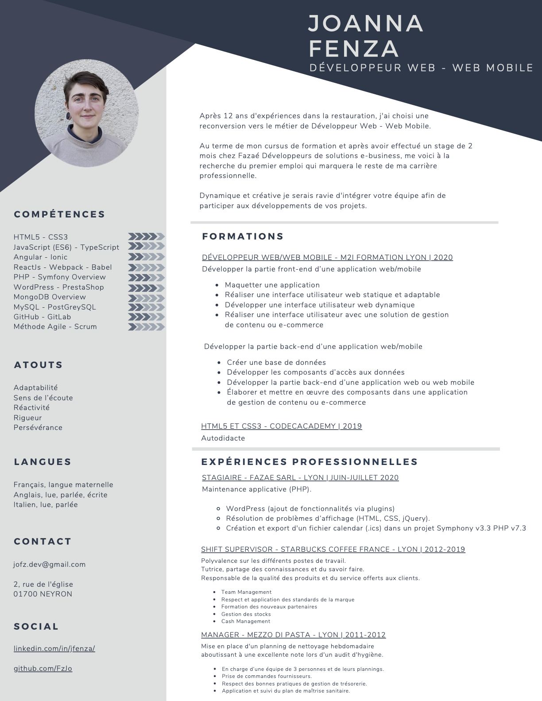

# Resume

## Rigor and seriousness characterize me

While at first glance my **career journey** seem unrelated each experience is connected to progress related to my **core values** : pedagogy, personal questioning and a balance of rigor and creativity. My **curiosity** and dedication to growth have been a key factor in both the formal and self taught education I have consistently pursued over the past decade.

## The need to understand

My journey has ultimately led me to Web development where I have focused my attention over the past year. Even if it takes me a little while, I won't let go until the concept is understood. I continue to supplement my lack of formal education in Tech with self study.

## My attention to detail

I am driven by curiosity and a desire to understand the world around me.

